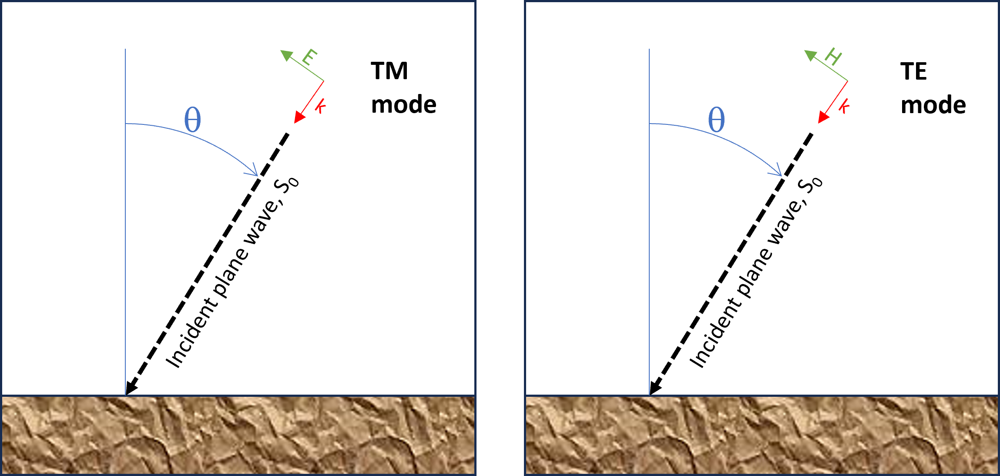
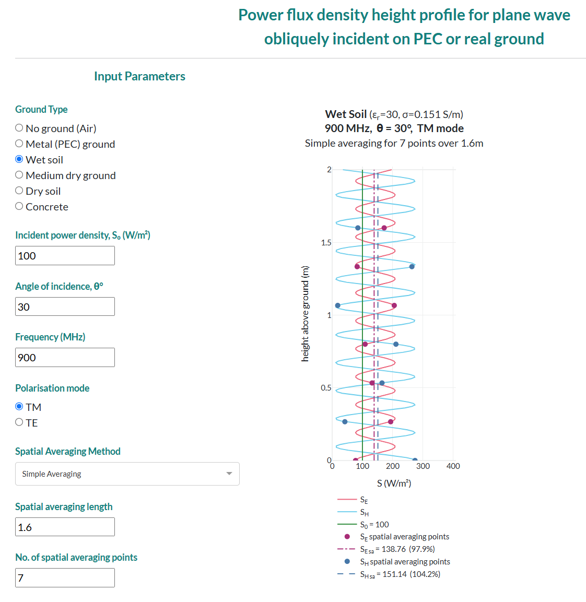

# planeRF

## RF wave reflections
Whenever a radiofrequency (RF) electromagnetic (EM) wave is incident on a ground, part of it may be _reflected_ and part may be _transmitted_ into the ground depending on the dielectric properties (permittivty $\epsilon$ and conductivity $\sigma$) of the ground and the characteristics of the RF wave (frequency, angle of incidence ($\theta$) and polarisation). 

Above ground, the cumulative contributions of the incident and reflected RF waves generate oscillating interference patterns in both the electric (E) and magnetic (H) components of the combined incident/reflected field. This `planeRF` app explores this phenomenon for a plane wave obliquely incident on an infinite flat ground.

In particular, the app displays the height profiles for the equivalent plane wave power density (S) calculated from the E and H fields, as indicated below: 
+ $S_E=|E|²/377$
+ $S_H=377|H|²$

The RF calculations of the app are based on exact analytical solutions for the complex electric (E) and magnetic (H) fields as described in the book "_Waves and Fields in Inhomogenous Media_" by Weng Cho Chew (1995).

The figure below displays how the angle of incidence ($\theta$) and polarisation (Transverse Magnetic or Transverse Electric) of the incident plane wave are defined:



## Spatial averaging
The app also explores various different spatial averaging schemes for assessing $S_E$ and $S_H$ of the combined incident/reflected plane wave for compliance with safety limits for human exposure to RF fields. For more information on this topic see: [spatial averaging scheme](https://2fc.gitbook.io/spatial-avg-wg/methodology/numerical-approaches-for-spatial-averaging)

## Code base for app
The app has been coded in python and may therefore be installed on a **Windows**, **Mac** or **Linux** computer. The app utilises the Plotly Dash library to generate an interactive display in a web browser. The `Dash` directory in this repository contains all the code related to the Dash web app, while the main codebase is located within the `src/planeRF` directory.

## App features
The main features of the planeRF web app include:
+ Widgets for setting the inputs of the reflected wave calculations:
  + Power density, $S_0$, of the incident plane wave (W/m²)
  + Frequency of incident plane wave ranging from 1 to 6000 MHz
  + Angle of incidence θ (degrees) of incident plane wave
  + Polarisation of incident plane wave:
    + Transverse Magnetic (TM)
    + Transverse Electric (TE)
  + Ground type:
    + Air, i.e. no ground
    + Perfect electric conductor (PEC) for simulating a metal ground
    + Wet soil
    + Medium dry soil
    + Dry soil
    + Concrete
+ Widgets for setting the spatial averaging scheme:
  + Number of spatial averaging points
  + Spatial averaging height
  + Selection of [spatial averaging scheme](https://2fc.gitbook.io/spatial-avg-wg/methodology/numerical-approaches-for-spatial-averaging):
    + Simple averaging
    + Riemman sum
    + Trapezoidal rule
    + Simpsons 1/3 rule
    + Simpsons 3/8 rule
    + Gaussian Legendre quadrature
+ Plot showing:
  + $S_0$, incident plane wave level
  + $S_E$, combined power density level of incident/reflected field for E
  + $S_H$, combined power density level of incident/reflected field for H
  + $S_{sa_E}$, spatial average level for $S_E$ values
  + $S_{sa_H}$, spatial average level for $S_H$ values
  + Spatial averaging points
  + Plot title dsiplaying the paramaters of the incident plane wave, the ground and the spatial averaging scheme
  
The app plot is interactive allowing the user to:
  + Save the plot to a .png file
  + Hide/display plot traces by clicking their corresponding legend title
  + Display trace point values (S level and height) by hovering over the traces

The percentage values shown in the plot legend for  $S_{sa_E}$ and $S_{sa_H}$ indicate their level relative to a highly accurate estimate of $S_{sa}$ which is the maximum value of $S_{sa_E}$ and $S_{sa_H}$ using 200 averaging points.

An example of the app's reflected fields calculation display is shown below:



## Getting started

### Installation

Clone this repository to your local machine:
```bash
git clone git@github.com:3EMEgos/planeRF.git
```
Enter the repository:
```bash
cd planeRF
```
Install `planeRF` preferably within a virtual environment, e.g., by using Conda:
```bash
conda create --name planeRF python=3.12
conda activate planeRF
python -m pip install --upgrade pip
python -m pip install -e .
```
To use the `planeRF` env in Jupyter or Jupyterlab, run the following commands:
```bash
conda activate planeRF
pip install ipykernel
ipython kernel install --user --name=planeRF
```

### To run the web app

Open a conda terminal.

Activate the `planeRF` environment:
```bash
conda activate planeRF
```

Change directory to the `planeRF` code folder.

Run the `app.py` file inside the `Dash` directory:

For Windows:
```bash
python Dash\app.py
```
For Mac and Linux:
```bash
python Dash/app.y
```

Open the Dash app at the http address indicted in the terminal, e.g.:
 ```bash
Dash is running on http://127.0.0.1:3000/
 ```

### Run the tests

In the root folder of the project, simply run
```bash
pytest tests
```
to run all the unit tests.

## Authors
Vitas Anderson

Yong Cai

Ante Kapetanović

## License
to-be-defined
